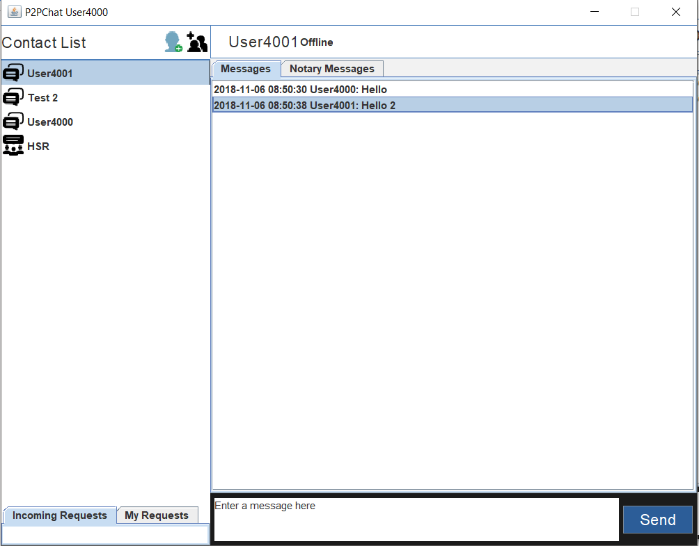

P2PChat - Distributed Chat Application
=======================================

Usage: `java Main <client-port> <bootstrap-peer-ip> <bootstrap-peer-port>`

All three parameters are optional. Default client-port is 4000.

Start the application
---------------------

Start the first application as follows.

    java Main

> It starts the application at port 4000. Since it is the first peer, there is no bootstrap peer required.

Then, start another application with the bootstrap peer.

    java Main 4001 127.0.0.1 4000

> Second application starts at port 4001 and communicates the peer at 127.0.0.1:4000 for bootstrapping.

Username and Account
---------------------

Username cannot be chosen freely. It is determined by the port as `User<port>` (e.g. User4000).
Therefore, **DO NOT** start the clients with the same port.

For the following usernames, there are already wallets available to interact with the Ropsten Ethernet test network.
* User4000
* User4001
* User4002
* User4003 

If you choose other ports, you have to create wallets by yourself and put them here: `wallets/wallet_User<port>.json`

User Interface
--------------

### Add a Friend

1. Click on the friend icon and enter the username of your friend (e.g. User4001)
2. The friend request appears in the incoming requests. When you click on the item, a popup appears to either accept or reject the friend request.

3. If the request is accepted, it appears in the contact list. You can start chatting with him by selecting it.
4. You can remove the friend by right clicking the contact item.

### Create a Group

1. Click on the group icon. 
2. Enter the group name and select the members you want to add.
3. Group can also be removed by right clicking the group.
